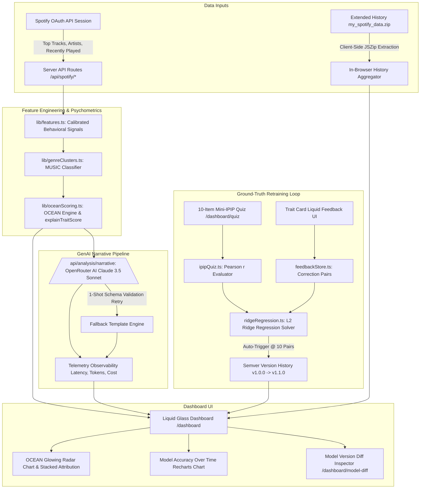

# 🎵 SpotiGlory

> **Liquid Glass Spotify Audio Analytics, Psychometric Personality Profiler, ML Retraining Engine & GenAI Narrative Pipeline**

[](https://nextjs.org/)
[](https://www.typescriptlang.org/)
[](https://tailwindcss.com/)
[](https://developer.spotify.com/)
[](https://openrouter.ai/)
[](LICENSE)

---

## 🌟 Overview

**SpotiGlory** is a full-stack, state-of-the-art Web application built with **Next.js 16 (App Router, Turbopack)** that transforms Spotify streaming data into a psychometric **Big Five (OCEAN)** personality profile, behavioral feature matrix, ground-truth validated ML model, and OpenRouter AI narrative.

Designed with an ultra-premium **Liquid Glass** design system—featuring specular refractions, dynamic glassmorphic panels, and Framer Motion micro-animations—SpotiGlory connects securely to Spotify via OAuth 2.0 PKCE. It processes listening data both through live Web API calls and in-browser extraction of **Extended Streaming History** archives (`my_spotify_data.zip`), producing empirical psychometric metrics without compromising user privacy.

---

## ✨ Key Features

### 1. 🎨 Liquid Glass Design System
- Custom **Liquid Glass UI** featuring dynamic specular highlights, backdrop blur refractions, interactive hover glow states, and HSL tailored dark-mode color palettes.
- Fully responsive navigation with a desktop fixed glass sidebar, mobile drawer, and interactive **Dev Tools Toggle** (`🔒 Dev Tools Hidden / 🔧 Dev Tools Active`).

### 2. 🔑 Spotify OAuth 2.0 & NextAuth.js Integration
- Secure authentication via NextAuth.js (Auth.js) requesting read-only scopes: `user-top-read`, `user-read-recently-played`, `user-read-email`, `user-read-private`.
- Automatic 1-hour access token refresh rotation handling Spotify token expirations server-side with 429 rate limit exponential backoff.

### 3. 📊 Behavioral Feature Engineering Engine (`src/lib/features.ts`)
Calculates pure mathematical signals from streaming records:
- **Calibrated Shannon Genre Entropy**:
  $$H = -\sum_{i=1}^n p_i \log_2(p_i), \quad H_{\text{norm}} = \frac{H}{\log_2(n)}$$
- **Explicit State Machine**: Distinguishes `"NO_DATA"` ($n=0$), `"SINGLE_GENRE"` ($n=1$, hyper-focused 0 entropy), and `"MULTI_GENRE"` ($n > 1$).
- **Acoustic Keyword Scanner**: Recovers genre signals from track/artist metadata if Spotify API returns empty `genres: []`.
- **24-Hour & 7-Day Circadian Stream Bucketing**: Powers an interactive 7x24 heatmap grid and late-night listener ratio gauge (10:00 PM to 5:00 AM UTC).
- **Artist Loyalty Index**: Ratio of unique artists to total track artist appearances.
- **Average Artist Popularity**: 0–100 mainstream vs. niche score recovery.
- **Jaccard Genre Taste Stability Score**:
  $$J = \frac{|S_{\text{short}} \cap S_{\text{long}}|}{|S_{\text{short}} \cup S_{\text{long}}|}$$
- **Recency Concentration Index**: Measures overlap between recently played tracks and top tracks.

### 4. 🧠 Rentfrow & Gosling MUSIC Model & Big Five Scoring Engine (`src/lib/genreClusters.ts` & `src/lib/oceanScoring.ts`)
- Empirical grouping of Spotify genre strings into 4 **MUSIC clusters** (Rentfrow & Gosling, 2003):
  - **Reflective & Complex**: Jazz, Classical, Blues, Folk, World, Singer-Songwriter.
  - **Intense & Rebellious**: Rock, Metal, Punk, Alternative, Grunge, Emo.
  - **Upbeat & Conventional**: Pop, Country, Soundtracks, Gospel.
  - **Energetic & Rhythmic**: Hip-hop, Rap, R&B, EDM, Electronic, House, Techno.
- Versioned psychometric scoring matrix (`src/config/oceanWeights.json v1.0.0`) normalizing inputs to $0..1$ *before* weighted sum, and clamping to $0..100$ *after*.
- **Uncertainty Quantification**: Calculates `confidence` (`"high"` | `"medium"` | `"low"`) and `reliabilityScore` ($0..100$) per trait based on sample variance and count ($N \le 50$).
- **Interactive Recharts Radar/Spider Chart**: Custom SVG glowing backdrop with specular vertex markers.

### 5. 🔍 "Why this score?" Feature Attribution Engine (`src/lib/oceanScoring.ts`)
- Pure function `explainTraitScore()` normalizing weighted feature contributions $|w_i \cdot x_i|$ so they sum to exactly $100\%$.
- Expandable trait card drawers in `PersonalityTab.tsx` rendering stacked liquid-glass progress bars and ranked driver summaries (e.g. *"Neuroticism (62/100) — driven 60% by Night-Listener Ratio, 40% by Recency Concentration"*).

### 6. 🤖 Production GenAI Narrative Pipeline via OpenRouter AI (`src/app/api/analysis/narrative/route.ts`)
- Integrated OpenRouter API calling `anthropic/claude-3.5-sonnet` with low temperature (`0.3`).
- **Deterministic Qualitative Grounding (`src/lib/narrativeBands.ts`)**: Pre-computes qualitative score bands (`very_low` .. `very_high`) in TypeScript to eliminate LLM number-to-text contradictions.
- **Prompt Versioning (`src/prompts/persona_v1.0.0.ts`)**: Versioned prompt template specification (`PROMPT_VERSION = "1.0.0"`).
- **Strict Schema Validation & 1-Shot Retry (`src/lib/narrativeSchema.ts`)**: Runtime Zod-style schema validator executing an automatic 1-shot retry with error feedback if malformed.
- **Production Telemetry**: Tracks and displays `{ modelUsed, latencyMs, tokenCount, estimatedCostUsd, promptVersion, retryAttempts }`.

### 7. 🎯 Ground-Truth Validation Quiz & Pearson Correlation Engine (`src/lib/ipipQuiz.ts`)
- 10-Item Mini-IPIP Likert survey on `/dashboard/quiz` measuring self-reported Big Five ground truth.
- Calculates Pearson correlation coefficients ($r = \frac{\sum (x - \bar{x})(y - \bar{y})}{\sqrt{\sum (x - \bar{x})^2 \sum (y - \bar{y})^2}}$) comparing Spotify computed scores against ground truth.

### 8. 📐 L2 Regularized Ridge Regression & Semver Retraining Engine (`src/lib/ridgeRegression.ts`)
- Pure TypeScript Ridge Regression solver fitting:
  $$\mathbf{w} = (\mathbf{X}^T \mathbf{X} + \lambda \mathbf{I})^{-1} \mathbf{X}^T \mathbf{y}$$
  using Gauss-Jordan elimination with partial pivoting.
- **Incremental Retraining (`retrainModel`)**: Aggregates Mini-IPIP quiz results and user feedback corrections.
- **Semver Model Versioning**: Bumps versions (`v1.0.0` $\rightarrow$ `v1.1.0` $\rightarrow$ `v1.2.0`) and stores version history (`spotiglory_model_versions`) alongside Pearson $r$ accuracy metrics.
- **10-Pair Auto-Retrain Trigger**: Automatically refits models when 10 user feedback samples accumulate in `src/lib/feedbackStore.ts`.

### 9. 📈 Model Accuracy Over Time Recharts Chart (`src/components/dashboard/ModelAccuracyChart.tsx`)
- Glowing Recharts Line Chart rendering Pearson $r$ correlation accuracy trending across semver model versions for all 5 OCEAN traits.

### 10. 🔀 Model Version Diff & Coefficient Comparer (`src/app/dashboard/model-diff/page.tsx`)
- Power-user transparency page allowing side-by-side coefficient weight comparisons between model versions with auto-generated plain-English impact statements.

### 11. 📁 Extended Streaming History Upload & Deep Analytics (`src/lib/extendedHistory.ts`)
- Client-side in-browser extraction using **JSZip**: drop `my_spotify_data.zip` or `Streaming_History_Audio_*.json` files directly.
- Calculates **All-Time Playback Duration** (in Hours & Days), **Real Skip Rates**, **Monthly Time-Series Bar Chart**, and **Top Tracks/Artists by Duration**.

---

## 🏗️ System Architecture & Data Flow



---

## 🛠️ Tech Stack

| Domain | Technology |
| :--- | :--- |
| **Framework** | [Next.js 16 (App Router)](https://nextjs.org/) with Turbopack |
| **Language** | [TypeScript 5](https://www.typescriptlang.org/) (Strict Type Checking) |
| **Styling** | [TailwindCSS v4](https://tailwindcss.com/) & Vanilla CSS Liquid Glass Design Tokens |
| **Authentication** | [NextAuth.js v4](https://next-auth.js.org/) (Spotify OAuth 2.0 Provider & Token Rotation) |
| **AI / GenAI** | [OpenRouter API](https://openrouter.ai/) (`anthropic/claude-3.5-sonnet` @ temp 0.3) |
| **ML Engine** | Pure TypeScript L2 Regularized Ridge Regression Solver & Pearson $r$ Correlation Evaluator |
| **Data Visualization** | [Recharts](https://recharts.org/) (RadarChart, LineChart & BarChart) |
| **Animations** | [Framer Motion 12](https://www.framer.com/motion/) & Lucide React Icons |
| **File Unzipping** | [JSZip](https://stuk.github.io/jszip/) (Client-Side Zip Extraction) |
| **Unit Testing** | Node.js Native Test Runner (`node:test` & `node:assert`) via `tsx` |

---

## 🚀 Getting Started

### Prerequisites
- **Node.js**: v18.17.0 or higher
- **Spotify Account**: Free or Premium
- **Spotify Developer Application**: Created on the [Spotify Developer Dashboard](https://developer.spotify.com/dashboard)
- **OpenRouter API Key**: (Optional, template fallback operates if omitted)

---

### Step 1: Clone the Repository & Install Dependencies

```bash
git clone https://github.com/GunaTeja777/SpotiGlory.git
cd SpotiGlory/SpotiGlory
npm install
```

---

### Step 2: Configure Environment Variables

Create a `.env.local` file in the project root directory (or copy from `.env.local.example`):

```bash
cp .env.local.example .env.local
```

Fill in your environment credentials:

```env
# Spotify API Credentials (from Spotify Developer Dashboard)
SPOTIFY_CLIENT_ID=your_spotify_client_id_here
SPOTIFY_CLIENT_SECRET=your_spotify_client_secret_here

# NextAuth Configuration
# Generate secret via: node -e "console.log(require('crypto').randomBytes(32).toString('base64'))"
NEXTAUTH_SECRET=your_generated_32_byte_base64_secret
NEXTAUTH_URL=http://127.0.0.1:3000

# OpenRouter API Key (for GenAI Personality Profile generation)
OPENROUTER_API_KEY=your_openrouter_api_key_here
```

---

### Step 3: Configure Spotify Developer Dashboard

1. Log in to the [Spotify Developer Dashboard](https://developer.spotify.com/dashboard).
2. Open your Application settings.
3. Under **Redirect URIs**, add:
   - `http://127.0.0.1:3000/api/auth/callback/spotify`
   - `http://localhost:3000/api/auth/callback/spotify`
4. Click **Save**.

---

### Step 4: Run the Development Server

```bash
npm run dev
```

Open your browser and navigate to **`http://127.0.0.1:3000`**.

---

## 🧪 Running Unit Tests

SpotiGlory includes **32 unit tests across 7 test suites** verifying Shannon entropy equations, timestamp bucketing, Jaccard similarity, OCEAN trait score clamping, Ridge Regression linear solvers, Pearson $r$ correlations, and GenAI schema validation.

Run all unit test suites using Node's test runner:

```bash
npx tsx --test src/lib/feedbackStore.test.ts src/lib/narrativeEval.test.ts src/lib/ipipQuiz.test.ts src/lib/ridgeRegression.test.ts src/lib/features.test.ts src/lib/oceanScoring.test.ts src/lib/extendedHistory.test.ts
```

---

## 🔬 Research Citations & Disclaimer

The psychometric scoring models in SpotiGlory draw theoretical framework from:

> **Rentfrow, P. J., & Gosling, S. D. (2003)**. *The Do Re Mi's of everyday life: The structure and personality correlates of music preferences*. Journal of Personality and Social Psychology, 84(6), 1236–1256.

> ⚠️ **Disclaimer**: *SpotiGlory is an experimental analysis tool built for musical self-reflection and entertainment based on published music-preference research. It is not a certified clinical or psychological diagnostic instrument.*

---

## 👨‍💻 Author & Credits

Crafted with ❤️ by **[GunaTeja777](https://github.com/GunaTeja777)**  
⭐ **Star the repo on GitHub**: [https://github.com/GunaTeja777/SpotiGlory](https://github.com/GunaTeja777/SpotiGlory)

---

## 📄 License

This project is licensed under the MIT License - see the [LICENSE](LICENSE) file for details.