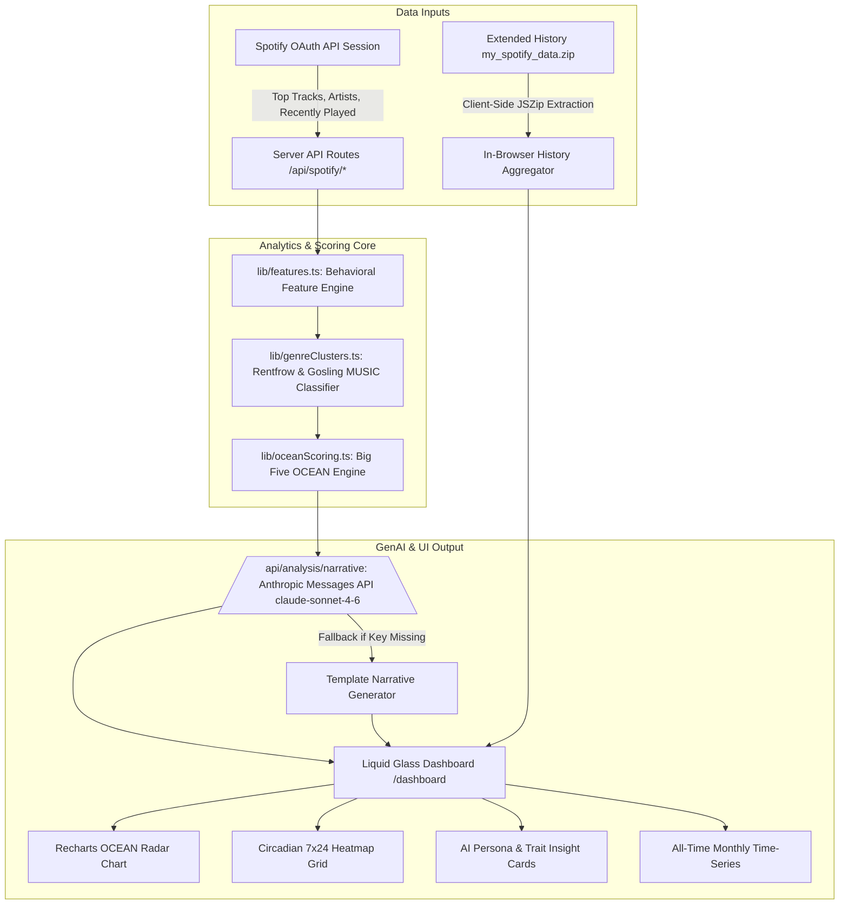

# 🎵 SpotiGlory

> **Liquid Glass Spotify Audio Analytics, Psychometric Personality Profiler & AI Narrative Engine**

[](https://nextjs.org/)
[](https://www.typescriptlang.org/)
[](https://tailwindcss.com/)
[](https://developer.spotify.com/)
[](https://www.anthropic.com/)
[](LICENSE)

---

## 🌟 Overview

**SpotiGlory** is a full-stack Web application built with **Next.js 16 (App Router, Turbopack)** that transforms Spotify listening data into a psychometric **Big Five (OCEAN)** personality profile, behavioral feature matrix, and AI-generated music narrative.

Designed with a state-of-the-art **Liquid Glass** aesthetic—featuring specular refractions, dynamic glassmorphic panels, and Framer Motion micro-animations—SpotiGlory connects securely to Spotify via OAuth 2.0 PKCE. It processes listening data both through live Web API calls and in-browser unzipping of full **Extended Streaming History** archives (`my_spotify_data.zip`), producing empirical metrics without compromising user privacy.

---

## ✨ Key Features

### 1. 🎨 Liquid Glass Design System
- Custom **Liquid Glass UI** featuring dynamic specular highlights, backdrop blur refractions, interactive hover glow states, and dark mode color palettes tailored with HSL Tailored Accents.
- Fully responsive navigation with a desktop fixed sidebar, mobile drawer, and bottom navigation bar.

### 2. 🔑 Spotify OAuth 2.0 & NextAuth.js Integration
- Secure authentication via NextAuth.js (Auth.js) requesting read-only scopes: `user-top-read`, `user-read-recently-played`, `user-read-email`, `user-read-private`.
- Automatic 1-hour access token refresh rotation handling Spotify token expirations server-side.

### 3. 📊 Behavioral Feature Engineering Engine (`lib/features.ts`)
Calculates pure, testable mathematical signals from streaming records:
- **Shannon Genre Entropy** ($H = -\sum p_i \log_2 p_i$) and normalized entropy ($0..1$) measuring genre diversity.
- **24-Hour & 7-Day Circadian Stream Bucketing** driving an interactive 7x24 heatmap grid.
- **Peak Listening Hour & Night Listener Ratio** (10:00 PM to 5:00 AM UTC night stream percentage).
- **Artist Loyalty Index** (unique artists / total track artist appearances; lower score = repeat depth).
- **Average Artist Popularity** (0–100 mainstream vs. niche score).
- **Jaccard Genre Stability Score** ($J = \frac{|S_{\text{short}} \cap S_{\text{long}}|}{|S_{\text{short}} \cup S_{\text{long}}|}$) tracking taste evolution across time horizons.
- **Recency Concentration Index** measuring overlap between recently played tracks and top tracks.

### 4. 🧠 Rentfrow & Gosling MUSIC Model & Big Five (OCEAN) Scoring Engine (`lib/genreClusters.ts` & `lib/oceanScoring.ts`)
- Keyword-matching parser grouping messy Spotify genre strings into 4 empirical **MUSIC clusters**:
  - **Reflective & Complex**: Jazz, Classical, Blues, Folk, World, Singer-Songwriter.
  - **Intense & Rebellious**: Rock, Metal, Punk, Alternative, Grunge, Emo.
  - **Upbeat & Conventional**: Pop, Country, Soundtracks, Gospel.
  - **Energetic & Rhythmic**: Hip-hop, Rap, R&B, EDM, Electronic, House, Techno.
- Transparent, weighted psychometric scoring equations mapping behavioral signals to the Big Five traits (0–100): **Openness**, **Conscientiousness**, **Extraversion**, **Agreeableness**, and **Neuroticism**.
- Interactive **Recharts Radar/Spider Chart** rendering the complete OCEAN trait spectrum.

### 5. 🤖 GenAI Narrative Layer powered by Claude (`lib/narrativePrompt.ts`)
- Calls the **Anthropic Messages API (`claude-sonnet-4-6`)** with a structured prompt grounded in the user's real listening numbers, peak hours, and top genres.
- Returns a structured JSON personality profile featuring:
  - **Evocative Listening Persona** (e.g., *"The Nocturnal Alchemist"*, *"The Eclectic Audio Curator"*).
  - **Headline & 2-3 Sentence Summary**.
  - **Individual Trait Insights** explaining each OCEAN score.
  - **Data-Driven Fun Facts**.
- Built-in deterministic **Template Fallback Engine** ensuring 100% uptime if an API key is missing or an API call times out.
- **Share Profile Button** with one-click clipboard copying and toast notifications.

### 6. 📁 Extended Streaming History Upload & Deep Analytics (`lib/extendedHistory.ts`)
- Client-side in-browser extraction using **JSZip**: users can drop `my_spotify_data.zip` or multiple `Streaming_History_Audio_*.json` files directly.
- Privacy-First: Raw personal logs are processed in-browser without persisting raw data on servers.
- Calculates **All-Time Listening Duration** (in total Hours & Days), **Real Skip Rates** (`skipped === true` || `reason_end === 'fwdbtn'` || `ms_played < 30000`), **Monthly Time-Series Bar Chart**, and **Top 20 Tracks/Artists by Cumulative Playback Duration**.

---

## 🏗️ Architecture & Data Flow



---

## 🛠️ Tech Stack

| Domain | Technology |
| :--- | :--- |
| **Framework** | [Next.js 16 (App Router)](https://nextjs.org/) with Turbopack |
| **Language** | [TypeScript 5](https://www.typescriptlang.org/) (Strict Type Checking) |
| **Styling** | [TailwindCSS v4](https://tailwindcss.com/) & Vanilla CSS Liquid Glass Design Tokens |
| **Authentication** | [NextAuth.js v4](https://next-auth.js.org/) (Spotify OAuth 2.0 Provider & Token Rotation) |
| **AI / GenAI** | [Anthropic Messages API](https://www.anthropic.com/) (`claude-sonnet-4-6`) |
| **Data Visualization** | [Recharts](https://recharts.org/) (RadarChart & BarChart) |
| **Animations** | [Framer Motion 12](https://www.framer.com/motion/) & Lucide React Icons |
| **File Unzipping** | [JSZip](https://stuk.github.io/jszip/) (Client-Side Zip Extraction) |
| **Unit Testing** | Node.js Native Test Runner (`node:test` & `node:assert`) via `tsx` |

---

## 🚀 Getting Started

### Prerequisites
- **Node.js**: v18.17.0 or higher
- **Spotify Account**: Free or Premium
- **Spotify Developer Application**: Created on the [Spotify Developer Dashboard](https://developer.spotify.com/dashboard)

---

### Step 1: Clone the Repository & Install Dependencies

```bash
git clone https://github.com/your-username/SpotiGlory.git
cd SpotiGlory/SpotiGlory
npm install
```

---

### Step 2: Configure Environment Variables

Create a `.env.local` file in the project root directory (or copy from `.env.local.example`):

```bash
cp .env.local.example .env.local
```

Fill in your environment credentials:

```env
# Spotify API Credentials (from Spotify Developer Dashboard)
SPOTIFY_CLIENT_ID=your_spotify_client_id_here
SPOTIFY_CLIENT_SECRET=your_spotify_client_secret_here

# NextAuth Configuration
# Generate a secret via: node -e "console.log(require('crypto').randomBytes(32).toString('base64'))"
NEXTAUTH_SECRET=your_generated_32_byte_base64_secret
NEXTAUTH_URL=http://127.0.0.1:3000

# Anthropic API Key (for GenAI Personality Profile generation)
ANTHROPIC_API_KEY=your_anthropic_api_key_here
```

---

### Step 3: Configure Spotify Developer Dashboard

1. Log in to the [Spotify Developer Dashboard](https://developer.spotify.com/dashboard).
2. Open your Application settings.
3. Under **Redirect URIs**, add:
   - `http://127.0.0.1:3000/api/auth/callback/spotify`
   - `http://localhost:3000/api/auth/callback/spotify`
4. Click **Save**.

---

### Step 4: Run the Development Server

```bash
npm run dev
```

Open your browser and navigate to **`http://127.0.0.1:3000`**.

---

## 🧪 Running Unit Tests

SpotiGlory includes comprehensive unit tests verifying Shannon entropy equations, timestamp bucketing, Jaccard similarity, OCEAN trait score clamping, and Extended History record aggregation.

Run all unit test suites using Node's test runner:

```bash
# Run Feature Engineering unit tests
npx tsx --test src/lib/features.test.ts

# Run OCEAN Scoring unit tests
npx tsx --test src/lib/oceanScoring.test.ts

# Run Extended History Aggregator unit tests
npx tsx --test src/lib/extendedHistory.test.ts
```

---

## 🔬 Research Citations & Disclaimer

The psychometric scoring models in SpotiGlory draw theoretical framework from:

> **Rentfrow, P. J., & Gosling, S. D. (2003)**. *The Do Re Mi's of everyday life: The structure and personality correlates of music preferences*. Journal of Personality and Social Psychology, 84(6), 1236–1256.

> ⚠️ **Disclaimer**: *SpotiGlory is an experimental analysis tool built for musical self-reflection and entertainment based on published music-preference research. It is not a certified clinical or psychological diagnostic instrument.*

---

## 📄 License

This project is licensed under the MIT License - see the [LICENSE](LICENSE) file for details.